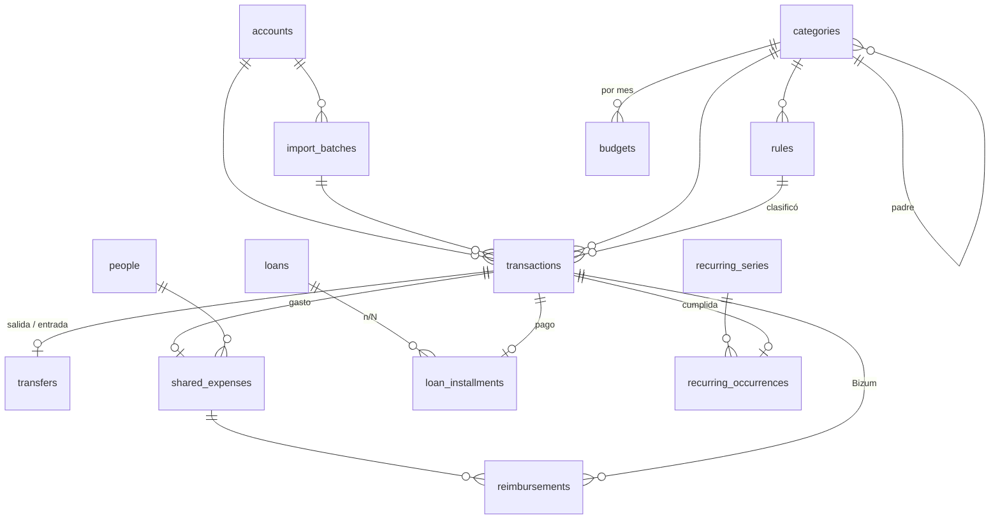

# ADR-0005: Modelo de datos (esquema inicial)

- **Estado:** aceptado
- **Fecha:** 2026-10-08

## Contexto

Hoy los gastos se llevan en un Excel con una hoja por mes (FEBRER, MARÇ…). Cada hoja agrupa los
movimientos en bloques (Ingressos, Estalvi, Hipoteca, Préstecs i finançacions, Subministraments,
Variables) con subcategorías, y tiene cinco rasgos que el esquema previsto en T2.4 no cubría:

1. **Gastos compartidos.** Muchos gastos los paga el usuario y Sergio le devuelve una parte por
   Bizum o transferencia (filas amarillas «Part proporcional Sergio», «Bizum – Recibido …»). La
   parte no siempre es el 50 %, y un mismo Bizum puede cubrir varios gastos: por ejemplo, 69,09 €
   cubren la cuota del préstamo (131,41 €) y el seguro de vida (6,77 €).
2. **Mes de imputación distinto de la fecha.** En FEBRER aparecen Bizums del 12/03/2026 que
   devuelven gastos de febrero y cuentan en febrero.
3. **Financiaciones con cuotas.** «Cetelem Colchón 18/24», «Ikea 8/10», «Aplazamiento Hacienda 7/12»
   y la hipoteca.
4. **Cargos previstos.** Filas plantilla «Data / 0,00 €» (Seguro de vida, IBI, Tasas de basuras,
   aportaciones a huchas) que se rellenan cuando llega el cargo.
5. **Varias cuentas y huchas de ahorro** (Sabadell conjunta, La Caixa, N26, Caixa Futur, Goin,
   Hucha Digital). El bloque «Estalvi» son traspasos a esas huchas, no gastos.

## Decisión

Una migración `001` (`src/app/workers/db/migrations/001-esquema-inicial.ts`) con 16 tablas
`STRICT`, triggers de integridad y una vista. Convenciones:

- Importes en **céntimos enteros con signo** (`*_cents`): negativo = sale dinero. `STRICT` impide
  guardar un `REAL` en una columna `INTEGER`.
- Fechas `TEXT` ISO `AAAA-MM-DD` validadas con `date(x) IS x`; meses `AAAA-MM`.
- Valores enumerados en español, igual que en el dominio.
- Borrado de categorías y cuentas con `RESTRICT`: el dominio reasigna antes (T4.1).

| Tabla                   | Para qué                                                                                                                                                                                                                               |
| ----------------------- | -------------------------------------------------------------------------------------------------------------------------------------------------------------------------------------------------------------------------------------- |
| `meta`                  | Fila única: `db_uuid` (UUID v4 generado en la migración), `revision`, `created_at`.                                                                                                                                                    |
| `settings`              | Clave/valor de preferencias.                                                                                                                                                                                                           |
| `accounts`              | Cuentas `corriente` o `ahorro`, `is_joint` para la conjunta, saldo y fecha de apertura. Solo los 4 últimos dígitos del IBAN.                                                                                                           |
| `people`                | Personas con las que se comparten gastos (alias).                                                                                                                                                                                      |
| `categories`            | Árbol con `kind` `ingreso`/`gasto`/`neutra`, color y orden; nombre único entre hermanas.                                                                                                                                               |
| `rules`                 | Reglas de autoclasificación (T1.6).                                                                                                                                                                                                    |
| `import_batches`        | Lotes de importación confirmados; `revertido` conserva el rastro.                                                                                                                                                                      |
| `transactions`          | Movimientos. `op_date` es la fecha original y `booked_date` la fecha imputada que fija el usuario (nula = la original). `period` es una columna generada con el mes de la fecha imputada; los informes mensuales agrupan por `period`. |
| `transfers`             | Une las dos patas de un traspaso entre cuentas propias (mismo importe, signos opuestos y cuentas distintas; lo valida un trigger).                                                                                                     |
| `shared_expenses`       | Marca un gasto como compartido: con quién y cuánto debe devolver (`expected_cents`, importe libre ≤ gasto).                                                                                                                            |
| `reimbursements`        | Reparte un ingreso (Bizum) entre uno o varios gastos compartidos. Los triggers impiden asignar más de lo recibido o devolver más de lo gastado.                                                                                        |
| `shared_expense_status` | Vista: devuelto y pendiente por gasto compartido.                                                                                                                                                                                      |
| `loans`                 | Hipoteca, préstamos, financiaciones y aplazamientos: cuota, nº de cuotas, primera cuota, TIN en puntos básicos y parte compartida opcional.                                                                                            |
| `loan_installments`     | Cuadro de cuotas `n/N`; pagada si tiene movimiento.                                                                                                                                                                                    |
| `recurring_series`      | Cargos esperados: suscripciones `detectada`s (Fase 7) y previstos `manual`es (IBI, seguros…); importe nulo si aún es desconocido.                                                                                                      |
| `recurring_occurrences` | Ocurrencias resueltas (`cumplida` con su movimiento u `omitida`); las pendientes se proyectan (T1.9).                                                                                                                                  |
| `budgets`               | Presupuesto por categoría y mes.                                                                                                                                                                                                       |

**Del Excel al modelo:**

| En el Excel                                        | En el modelo                                                                                             |
| -------------------------------------------------- | -------------------------------------------------------------------------------------------------------- |
| Bloque y fila de color (Hipoteca › Asegurances…)   | Categoría raíz › subcategoría (plantilla en `seeds/category-template.ts`, traducida al castellano)       |
| Fila amarilla «Part proporcional / Bizum Recibido» | Movimiento positivo en la misma categoría + `reimbursements` hacia el gasto (`shared_expenses`)          |
| Bizum de marzo en la hoja de febrero               | `booked_date = '2026-02-27'` (fecha imputada); al enlazar un reembolso la app propone la fecha del gasto |
| «Cetelem Colchón 18/24»                            | `loans` + `loan_installments.number = 18`                                                                |
| Fila «Data / 0,00 €» (IBI, Seguro de vida)         | `recurring_series` `manual` sin importe; al llegar el cargo, `recurring_occurrences` `cumplida`          |
| Estalvi › Caixa Futur 100 €                        | Cuenta `ahorro` + `transfers` (categoría neutra «Ahorro»)                                                |
| «Devolución Primark», «Devolución transferencia»   | Importe de signo contrario en la misma categoría: resta del gasto o del ingreso (regla de T1.2)          |
| Total del bloque                                   | Agregación SQL por `period` y categoría (T2.6); no se guardan totales                                    |

## Consecuencias

- Las invariantes de dinero (céntimos, signos de traspasos y reembolsos, no repartir de más) las
  garantiza la BD además del dominio. Que un reembolso o un traspaso no deje de cuadrar porque
  después se cambie el importe del movimiento lo revalida el dominio, no los triggers.
- Al borrar un movimiento (p. ej. al revertir un lote) se borran en cascada sus enlaces: el gasto
  vuelve a quedar pendiente de cobrar, la cuota vuelve a quedar sin pagar y el cargo previsto
  vuelve a quedar pendiente.
- La parte que devuelve Sergio sigue contando en la categoría del movimiento de reembolso. Si un
  Bizum cubre gastos de categorías distintas, el desglose exacto por categoría se obtiene de
  `reimbursements` (T2.6).
- El traspaso a la cuenta conjunta para pagar la hipoteca se puede registrar como gasto (si la
  conjunta no se sigue) o como `transfers` (si se da de alta como cuenta).
- Las cuotas de los préstamos se suponen mensuales; otra periodicidad necesitaría una migración.
- La plantilla de categorías se publica con la app (es código): incluye «Yes Be More» tal cual
  estaba en el Excel.
- `recurring_id` deja de estar en `transactions`: el vínculo movimiento ↔ serie vive en
  `recurring_occurrences` (una sola fuente de verdad).
